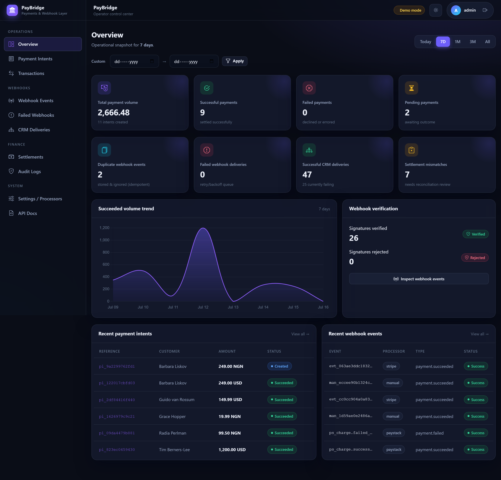
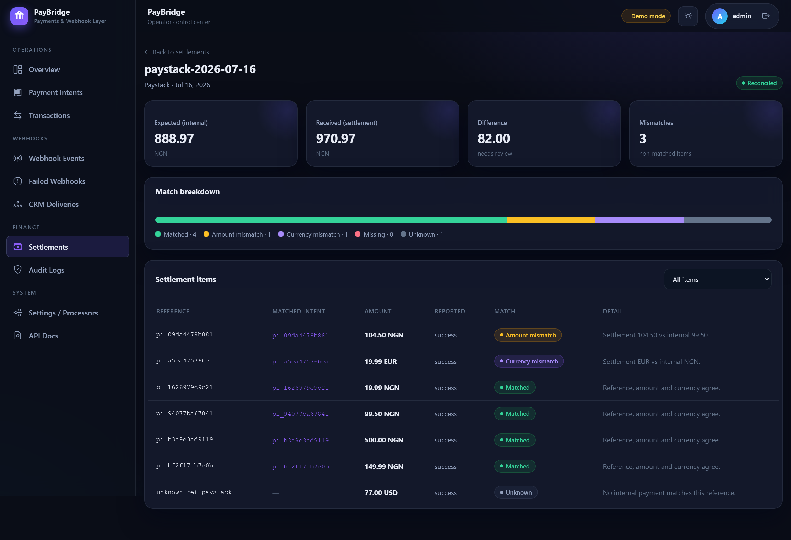
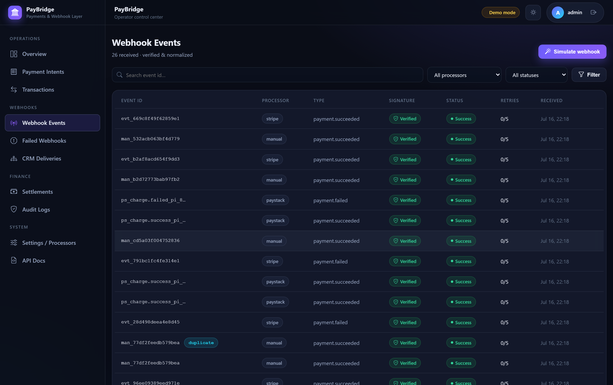
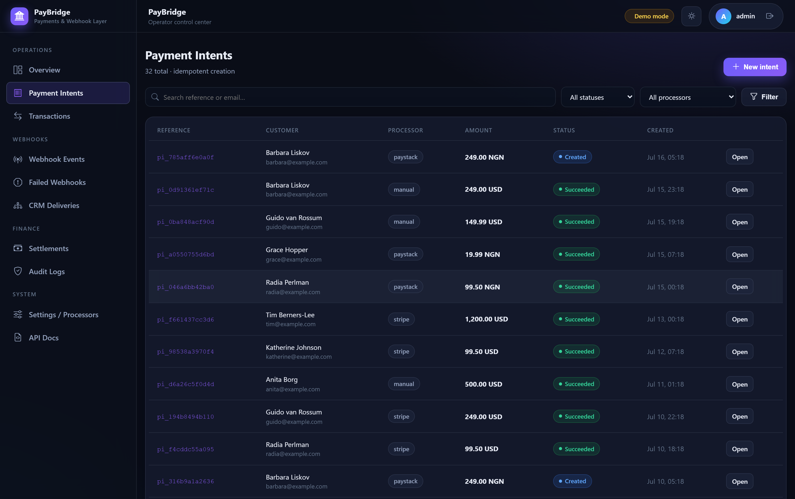
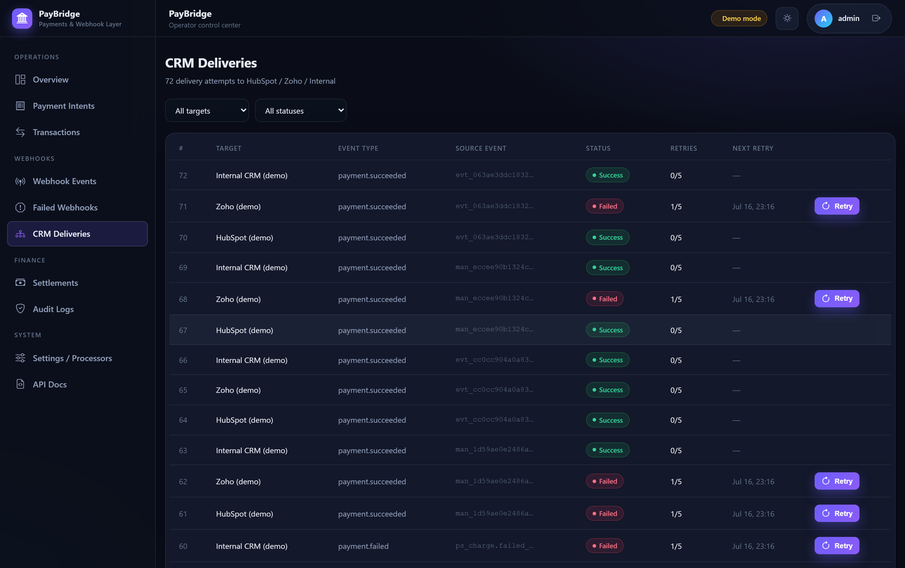
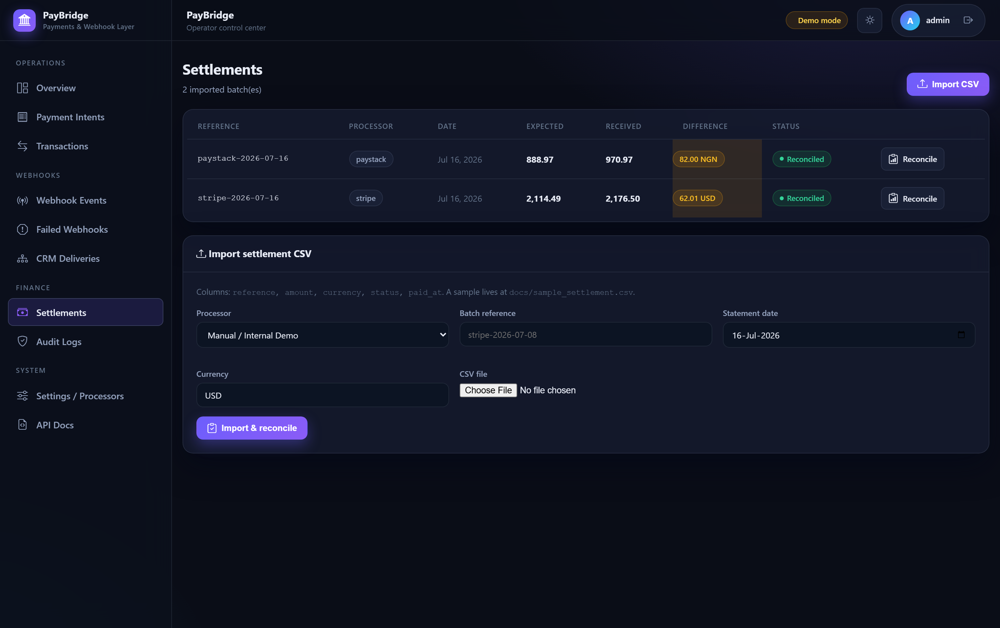
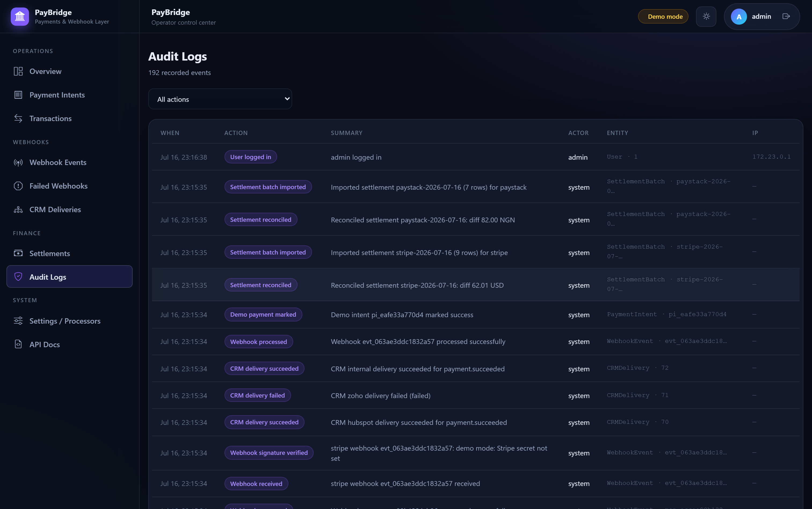
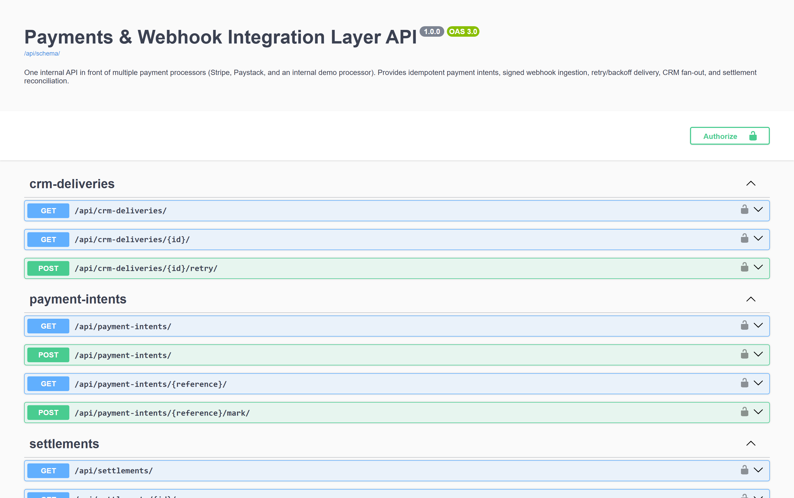
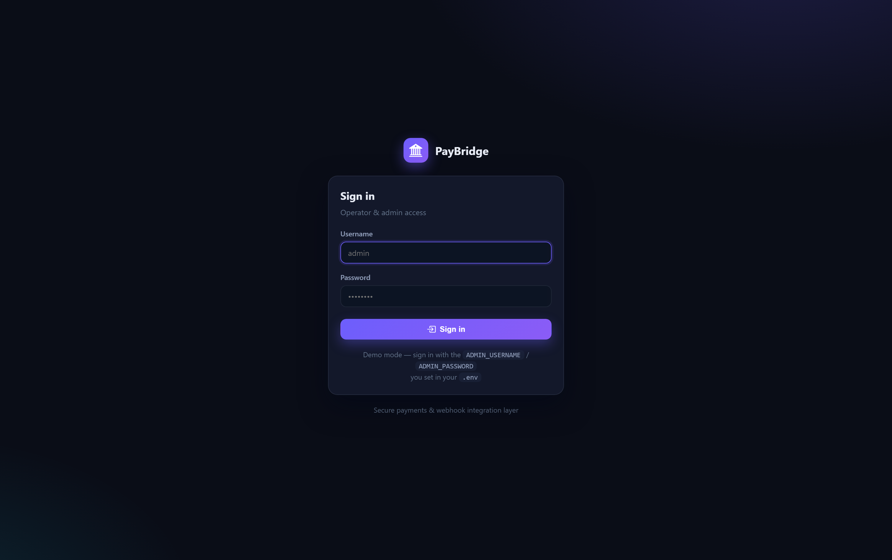

# PayBridge — Payments & Webhook Integration Layer


One internal API in front of Stripe, Paystack and an internal/manual processor: idempotent payment
intents, signed webhook ingestion, duplicate suppression, retry/backoff, CRM fan-out, and settlement
reconciliation.

PayBridge is a Django 5.1 + DRF service that sits between an application and its payment providers.
Instead of scattering provider-specific SDK calls and webhook handlers across a codebase, it exposes a
single normalized API: create a payment intent with an idempotency key, receive signed webhooks at one
verified endpoint per processor, and read one internal event shape regardless of origin. Failed work
(webhook processing, CRM delivery) is retried with exponential backoff rather than dropped. Every state
change is written to an immutable audit log, and an operator dashboard exposes intents, transactions,
webhook events, failed deliveries, settlements and reconciliation results.

Business logic lives in a services layer (`apps/*/services.py`), not in views — the REST API, the
dashboard and the management commands all call the same functions.

The project runs end-to-end with no external accounts and no processor credentials.

---

## Features

- **Idempotent payment intents** — `idempotency_key` is unique; a replayed key returns the original
  intent with `"idempotent_replay": true` and HTTP 200 (201 only on first create). An `IntegrityError`
  fallback covers the concurrent-create race.
- **Signed webhook ingestion** — real Stripe (HMAC-SHA256 + timestamp tolerance) and Paystack
  (HMAC-SHA512) verification schemes, compared with `hmac.compare_digest`.
- **Duplicate-event suppression** — a re-delivered `event_id` is stored for audit, flagged
  `is_duplicate`, and never reprocessed.
- **Event normalization** — Stripe, Paystack and internal payloads collapse into one internal event
  shape before they touch business logic.
- **Retry with exponential backoff** — shared `RetryableJob` base for webhook events and CRM
  deliveries; `delay = RETRY_BASE_SECONDS * 2**retry_count`, capped at `RETRY_MAX_BACKOFF_SECONDS`.
- **CRM fan-out** — successful payments fan out to HubSpot / Zoho / internal CRM targets (simulated
  delivery), each retried independently.
- **Settlement reconciliation** — CSV statement import matched against internal records, with five
  match flags and expected/received/difference batch totals.
- **Immutable audit log** — actor, action, IP address and context for every meaningful state change.
- **Operator dashboard** — dark-glass UI with KPIs, volume chart, filtering, manual retry actions and a
  webhook simulator that posts through the real production pipeline.
- **OpenAPI documentation** — Swagger UI and ReDoc generated by drf-spectacular.

---

## Screenshots


*Overview — KPIs, payment volume chart and recent activity.*


*Reconciliation — a settlement batch broken down by match status with expected/received/difference.*


*Webhook events — signature verification state, duplicates, retry counts and the simulator.*


*Payment intents — idempotency keys, processor, amount and status.*


*CRM deliveries — per-target fan-out with retry state and last error.*


*Settlements — imported batches with balance status and mismatch counts.*


*Audit logs — immutable record of actor, action and context.*


*Swagger UI at `/api/docs/`.*


*Session-authenticated operator login.*

---

## Architecture

| App | Responsibility |
|-----|----------------|
| `apps/accounts` | Session auth, login/logout, `create_admin` command, auth audit signals |
| `apps/processors` | `PaymentProcessor` registry and default processor seeding |
| `apps/payments` | `PaymentIntent`, `PaymentTransaction`, idempotent intent creation |
| `apps/webhooks` | Ingestion, signature verification, normalization, retries, simulation |
| `apps/crm` | `CRMDelivery` fan-out with independent retry/backoff |
| `apps/settlements` | CSV settlement import and reconciliation |
| `apps/audit` | Immutable `AuditLog` |
| `apps/dashboard` | Operator UI, metrics, `seed_demo_data` command |
| `apps/api` | DRF serializers and views |
| `apps/common` | Shared retry/backoff primitives (`RetryableJob`, backoff math) |

Event flow:

```
POST /api/webhooks/{stripe|paystack|internal}/
    -> verify signature (HMAC, constant-time compare)   # rejected -> store, audit, HTTP 400
    -> normalize into the internal event shape          # event_id is read from here
    -> idempotency check (known event_id? store, flag duplicate, stop, HTTP 200)
    -> apply to the PaymentIntent / PaymentTransaction
    -> fan out to CRM targets (retryable)
```

Normalization runs before the idempotency check because the event id is read off the normalized shape.
Audit entries are not a final step — one is written at each stage (`webhook_received`, then
`webhook_verified` or `webhook_rejected`, then `webhook_duplicate` or `webhook_processed`).

Failed webhook and CRM jobs are picked up later by `python manage.py process_webhook_retries`, which
respects each job's `next_retry_at` backoff schedule.

Full walkthrough: [docs/PROJECTFLOW.md](docs/PROJECTFLOW.md).

---

## Supported payment processors

| Processor | Code | Webhook route | Verification |
|-----------|------|---------------|--------------|
| Stripe | `stripe` | `/api/webhooks/stripe/` | HMAC-SHA256 over `{timestamp}.{raw_body}`, keyed with `STRIPE_WEBHOOK_SECRET` |
| Paystack | `paystack` | `/api/webhooks/paystack/` | HMAC-SHA512 over the raw body, keyed with `PAYSTACK_SECRET_KEY` |
| Internal / manual demo | `manual` | `/api/webhooks/internal/` | None — accepted and flagged as a demo event |

Processor credentials are optional. When the governing secret above is **present**, that processor is
always strictly verified; when it is **absent**, the payload is accepted and flagged demo-verified so
the pipeline stays runnable without live credentials. `STRIPE_SECRET_KEY` / `PAYSTACK_SECRET_KEY`
additionally drive the Live/Demo mode label shown for each processor.

---

## Webhook security and idempotency

**Stripe.** The `Stripe-Signature` header carries `t=<unix>,v1=<hex>`. The service recomputes
`HMAC-SHA256("{t}.{raw_body}", STRIPE_WEBHOOK_SECRET)` and compares it with `hmac.compare_digest`. A
timestamp outside a 300-second tolerance is rejected, which bounds replay attacks.

**Paystack.** The `x-paystack-signature` header carries a hex `HMAC-SHA512` of the raw body keyed with
`PAYSTACK_SECRET_KEY`, again compared with `hmac.compare_digest`.

Verification runs against the **raw request body** — not a re-serialized dict — so key ordering and
whitespace cannot break the digest.

**Idempotency.** Payment intents are keyed on a unique `idempotency_key`; a repeat returns the original
intent rather than creating a second one. For webhooks, the first non-duplicate event for a
`(processor, event_id)` pair wins. Later re-deliveries are still persisted — deliberately, there is
**no database unique constraint** on that pair — but they are flagged `is_duplicate`, acknowledged with
HTTP 200, and never reprocessed. Suppression is enforced in the service layer so that duplicates remain
visible for audit instead of being rejected at the database boundary.

Details: [docs/WEBHOOKS.md](docs/WEBHOOKS.md).

---

## Settlement reconciliation

A processor statement is imported as CSV. The required columns are `reference`, `amount`, `currency` and
`status`; `paid_at` is optional. Lines are matched one-by-one against internal payment intents, and each
receives one of five flags:

| Flag | Meaning |
|------|---------|
| `matched` | Reference, amount and currency all agree |
| `currency_mismatch` | Reference found, currency differs (checked before amount) |
| `amount_mismatch` | Reference found, currency agrees, amount differs |
| `missing` | Internal payment succeeded but never appeared on the statement |
| `unknown` | Statement line has no matching internal record |

Each batch carries `expected_amount` (internal succeeded total), `received_amount` (settlement line
total) and their `difference`; a batch is balanced when the difference is zero.

A sample statement is provided at [docs/sample_settlement.csv](docs/sample_settlement.csv). Details:
[docs/RECONCILIATION.md](docs/RECONCILIATION.md).

---

## Technology stack

Python · Django 5.1 · Django REST Framework · drf-spectacular (OpenAPI) · django-filter · WhiteNoise ·
Gunicorn · SQLite · Docker / Docker Compose · HTML/CSS · Bootstrap Icons · Chart.js.

Authentication is Django session auth with a single admin/operator account.

---

## Quick start (Docker)

```bash
git clone https://github.com/<your-username>/payments-webhook-integration-layer.git
cd payments-webhook-integration-layer
cp .env.example .env
```

Edit `.env` and set at minimum:

- `SECRET_KEY` — generate one with
  `python -c "from django.core.management.utils import get_random_secret_key as k; print(k())"`
- `ADMIN_PASSWORD` — **your own** strong password. The admin account is created only when this is set;
  there is no default.

Then start the stack.

**Option A — automatic free port (Windows PowerShell):**

```powershell
./scripts/run_free_port.ps1
```

The script picks and confirms a free port in `[10000, 60000]`, writes `APP_PORT` and
`CSRF_TRUSTED_ORIGINS` into `.env`, runs `docker compose up --build -d`, and prints the URL. It only
tests ports by binding and releasing a listener — it never stops or kills any process.

**Option B — any platform:**

Set `APP_PORT` to a free host port in `.env`, set `CSRF_TRUSTED_ORIGINS` to match (for example
`http://localhost:<APP_PORT>,http://127.0.0.1:<APP_PORT>`), then:

```bash
docker compose up --build -d
docker compose logs -f web        # migrations, seed, gunicorn
```

Open `http://localhost:<APP_PORT>/` and sign in with the `ADMIN_USERNAME` / `ADMIN_PASSWORD` from your
`.env`.

Compose maps `${APP_PORT}:8000` — the container always listens on 8000, and the host port is whatever
you (or the script) chose. The SQLite database persists on the named volume `app_db` mounted at `/data`.

### Routes

| Route | Purpose |
|-------|---------|
| `/` | Redirects to the dashboard |
| `/login/`, `/logout/` | Operator session auth |
| `/dashboard/` | Overview, intents, transactions, webhooks, failed webhooks, CRM, settlements, audit, settings |
| `/api/docs/`, `/api/redoc/`, `/api/schema/` | API documentation and OpenAPI schema |
| `/api/payment-intents/`, `/api/webhook-events/`, `/api/crm-deliveries/`, `/api/settlements/` | REST resources |
| `/api/webhooks/stripe/`, `/api/webhooks/paystack/`, `/api/webhooks/internal/` | Webhook receivers |
| `/django-admin/` | Django admin |

---

## Environment variables

| Variable | Purpose |
|----------|---------|
| `APP_PORT` | Host port mapped to container port 8000 |
| `SECRET_KEY` | Django secret. If unset, an obviously-insecure development key is used — set a real one outside local development |
| `DEBUG`, `ALLOWED_HOSTS`, `CSRF_TRUSTED_ORIGINS` | Core Django configuration |
| `SITE_NAME`, `TIME_ZONE` | Branding and timezone |
| `ADMIN_USERNAME`, `ADMIN_EMAIL`, `ADMIN_PASSWORD` | Operator account. Defaults: `admin`, `admin@example.com`, and **no password default** — set your own |
| `DEMO_MODE` | Dashboard demo banner only; defaults to on unless `STRIPE_SECRET_KEY` or `PAYSTACK_SECRET_KEY` is set |
| `STRIPE_SECRET_KEY` | Optional. Drives Stripe's Live/Demo label and the `DEMO_MODE` default |
| `STRIPE_WEBHOOK_SECRET` | Optional. HMAC key for Stripe webhook verification; unset means demo-accept |
| `PAYSTACK_SECRET_KEY` | Optional. HMAC key for Paystack webhook verification, plus Paystack's Live/Demo label and the `DEMO_MODE` default |
| `PAYSTACK_WEBHOOK_SECRET` | Defined but currently unused — Paystack signs with `PAYSTACK_SECRET_KEY` |
| `RETRY_MAX_ATTEMPTS`, `RETRY_BASE_SECONDS`, `RETRY_MAX_BACKOFF_SECONDS` | Retry/backoff tuning |
| `DB_DIR` | SQLite directory (set to `/data` by Compose) |
| `LOG_LEVEL` | Root log level |

Every variable and its default is documented in [ENVIRONMENT.md](ENVIRONMENT.md).

---

## Database migrations

`docker-entrypoint.sh` runs migrations automatically on every container start, before seeding, static
collection and Gunicorn (3 workers on port 8000). To run them manually:

```bash
docker compose exec web python manage.py migrate
```

---

## Demo data

Seeding runs automatically at container start and is idempotent. To re-run or reset:

```bash
docker compose exec web python manage.py seed_demo_data           # idempotent
docker compose exec web python manage.py seed_demo_data --fresh   # wipe seeded data and reseed
```

It ensures the default processors, creates the admin account (when `ADMIN_PASSWORD` is set), and
produces 32 payment intents, 26 webhook events, 72 CRM deliveries, 2 settlement batches (including
deliberate mismatches) and 191 audit log entries.

To process due retries on demand:

```bash
docker compose exec web python manage.py process_webhook_retries
docker compose exec web python manage.py process_webhook_retries --limit 50   # cap per queue (default 100)
```

---

## Tests

```bash
docker compose run --rm --entrypoint "" web python manage.py test
```

29 tests, all passing, covering signature verification, idempotency, duplicate suppression,
normalization, backoff math, CRM fan-out, reconciliation and the dashboard views.

Run the suite in Docker (the image is `python:3.12-slim`). Django 5.1's test client is incompatible with
Python 3.14 — a `copy()` bug in its template-context instrumentation — so the template-rendering tests
fail on a 3.14 host even though the service-layer tests pass there. See [docs/TESTING.md](docs/TESTING.md).

---

## API documentation

| Route | Contents |
|-------|----------|
| `/api/docs/` | Swagger UI |
| `/api/redoc/` | ReDoc |
| `/api/schema/` | Raw OpenAPI schema |

Endpoint-by-endpoint reference: [docs/API.md](docs/API.md).

---

## Demo mode

`DEMO_MODE` defaults to `not (STRIPE_SECRET_KEY or PAYSTACK_SECRET_KEY)` — it is automatically on when
no processor secret is configured, so the project is fully runnable with no external accounts.

`DEMO_MODE` is a **display flag only**: it is read by the dashboard context processor to show the demo
banner, and it gates nothing in the pipeline. Signature behaviour is decided entirely by whether the
governing secret is set:

- `STRIPE_WEBHOOK_SECRET` set -> Stripe signatures strictly verified; unset -> accepted, flagged demo.
- `PAYSTACK_SECRET_KEY` set -> Paystack signatures strictly verified; unset -> accepted, flagged demo.
- The internal/manual endpoint is always accepted and flagged demo.

The two are independent, which has one consequence worth knowing: setting `DEMO_MODE=False` does **not**
turn on strict verification for a processor whose secret is absent, and setting `STRIPE_SECRET_KEY`
without `STRIPE_WEBHOOK_SECRET` clears the demo banner while Stripe webhooks are still demo-accepted.
Set the webhook secret itself to enforce verification.

A **present** secret is never weakened: an invalid signature is rejected regardless of `DEMO_MODE`.

The dashboard's webhook simulator builds a realistically-shaped, signed payload for the target
processor and posts it through the exact production pipeline — verify, idempotency, normalize, apply,
CRM fan-out — so demo traffic exercises the same code path as live traffic.

---

## Security

Signed webhook verification with constant-time comparison, replay protection, idempotency, CSRF-protected
dashboard, environment-only secrets, immutable audit logging, and security headers tightened
automatically when `DEBUG` is off.

Never commit `.env`. Set your own `SECRET_KEY` and `ADMIN_PASSWORD` before deploying anywhere reachable.

Vulnerability reporting: [SECURITY.md](SECURITY.md). Threat model and controls:
[docs/SECURITY.md](docs/SECURITY.md). Deployment hardening: [docs/DEPLOYMENT.md](docs/DEPLOYMENT.md).

---

## Project status

Complete and stable. This is a portfolio project built to demonstrate payment-integration architecture —
idempotency, signature verification, retry semantics and reconciliation — rather than a commercial
product. 29 tests pass. CRM delivery is simulated; no live CRM HTTP calls are made.

See [FEATURES.md](FEATURES.md) for the full capability list and [CHANGELOG.md](CHANGELOG.md) for release
history.

---

## License

MIT — see [LICENSE](LICENSE).
